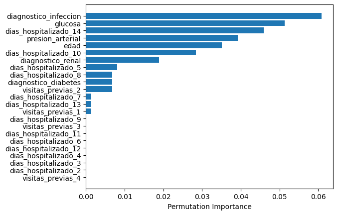

# readmission_risk_predictor
Proyecto de Machine Learning para predecir el riesgo de rehospitalización temprana (dentro de los 30 días) en pacientes. Utilizando un conjunto de datos que incluye información demográfica, historial médico y resultados de pruebas, este modelo busca identificar pacientes que podrían necesitar una atención de seguimiento más intensiva para prevenir readmisiones. La compañía farmacéutica puede utilizar esta herramienta para optimizar sus programas de apoyo al paciente.

# Contexto del proyecto
El objetivo es identificar pacientes de alto riesgo utilizando datos como edad, diagnóstico principal, número de días hospitalizado, visitas previas, glucosa en sangre y presión arterial. El modelo busca mejorar la planificación del seguimiento post-alta y potencialmente reducir las tasas de rehospitalización.

## Objetivo del proyecto
Crear un modelo que prediga si un paciente será re-hospitalizado en los siguientes 30 días.

## Modelos de machine learning creados
- Logistic Regression
- Decission Tree Classifier
- Random Forest Classifier
- Light Gradient Boosting Machine (Light GBM)

## Principales métodos y técnicas utilizados
- Analisis exploratorio de datos (valores ausentes y duplicados)
- Ingeniería de características (creación de nuevas características)
- Codificación OHE y escalamiento estándar
- Graficación y filtrado avanzado

## Librerías principales utilizadas
- pandas
- matplotlib
- seaborn
- numpy
- sklearn
- imblearn

## Descubrimientos clave

**Características más importantes para la predicción**

## Resultados
- Se establecieron las métricas recall, f1 score y ROC AUC como las más importantes para la evaluación del modelo.
- Se entrenaron distintos modelos de clasificación y se eligió el mejor, de acuerdo a las métricas establecidas.
- Se priorizó el recall debido al contexto del proyecto, buscando elevarlo a través del ajuste del umbral de clasificación.
- Se identificaron las variables con mayor relevancia en la rehospitalización de un paciente. 
- En el archivo proyecto_preddicion_rehospitalizaicon se puede visualizar el desarrollo completo del proyecto.
